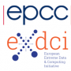

# Promoting Science on Computers to Schools - Workshop Event

## Registration

Registration is open: [Online Form](http://bit.ly/190708-SciOnComp)

## Summary

Funded by EXDCI-2, EPCC is organising a 2-day workshop in Edinburgh on 8-9 July 2019 to present ideas on how science and engineering can be supported from Raspberry Pis to large scale supercomputers. We are looking to investigate how to introduce these topics to school-age audiences including linking to existing school curricula. This will include examples of existing education materials and activities and looking ahead to current plans.

We are interested in a wide range of areas including encouraging school children to learn to program, showing the benefits of computer simulations, what can be learned from big data and how data is collected and used online.

The aim of the workshop is to promote discussion between school teachers and those developing computer-based activities and demonstrators. After the workshop we will write a report covering the outcomes.

We are keen to have participants from across the range of education including teachers involved in scientific subjects and primary education, and computational and data scientists with an interest in supporting school development. This workshop is intended to benefit participants from the UK and the EU.

We have a limited level of funding to support travel and accommodation costs for attendees from the UK and EU, and you will be able to submit an application for this as part of the Registration form.

Registration is open: [Online Form](http://bit.ly/190708-SciOnComp)

### Programme

This is the draft programme for the two day workshop - it can be changed and anyone wishing to contribute a talk or discussion should contact the organisers. Any contributions are most welcome.

#### Monday 8th July

##### 09:30
Registration and Welcome

##### 10:00 - 12:00   
Showcase of existing activities including Raspberry Pi clusters

##### 12:00 - 13:00
Lunch (provided for all attendees)

##### 13:00 - 16:00 (Tea Break Included)

* Discussion of what schools, students and teachers need
* Identify gaps in current provisioning of training and materials

##### 16:00 - 17:00
Existing Collaborations with Schools

##### 17:00
Close

##### 18:00 (approx) 
Evening meal provided for all attendees - Venue TDB

#### Tuesday 9th July
##### 09:00 - 09:30
Welcome and Recap

##### 09:30 - 11:00 
Cross-Curriculm Projects and Getting Support - Looking at how projects can integrate subjects in the curriculm using computers and how external groups could help support this.

##### 11:00 - 12:30 
Presentations of HPC, Data Science and Computing Topics

##### 12:30 - 13:30
Lunch (provided for all attendees)

##### 13:30 - 14:30
Discussion of issues around online safety

##### 14:30 - 15:30
Moving Forward - what do we go away with looking to do

##### 15:30 - 16:00
Recap and Summary

##### 16:00
Close

### Getting Here

The Venue is the Bayes Centre at The University of Edinburgh.

#### Address

EPCC
The University of Edinburgh
The Bayes Centre
47 Potterrow
Edinburgh
EH8 9BT

[Find EPCC on Google Maps](https://goo.gl/maps/nxUJZ1KxDYmMptcz8)

Travelling to the University:

The university has a guide to how to reach the university here:
[https://www.ed.ac.uk/visit/city/getting-here](https://www.ed.ac.uk/visit/city/getting-here)

### Accommodation

There is numerous options for accommodation in Edinburgh (these are options and other travel and accommodation sites may provide other options for accommodation):

* [https://www.edinburghfirst.co.uk/accommodation-internal/](https://www.edinburghfirst.co.uk/accommodation-internal/)
* [https://edinburgh.org/hotels](https://edinburgh.org/hotels)

### Contacting Us

If you have any questions or queries please contact the workshop organiser or EPCC who will forward queries onto the workshop organiser.

#### Contacts:
Organiser - Alistair Grant - a.grant@epcc.ed.ac.uk
EPCC - info@epcc.ed.ac.uk

### FAQ

Questions coming...
